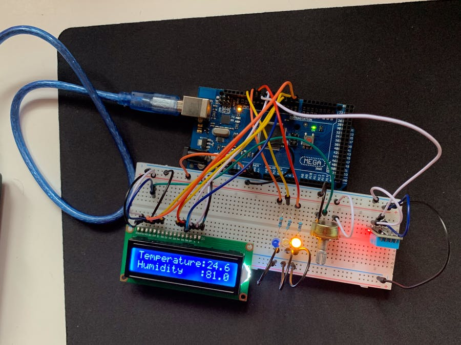
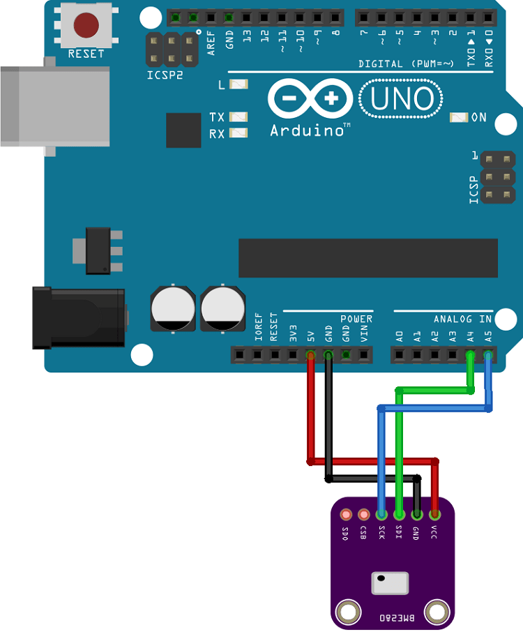
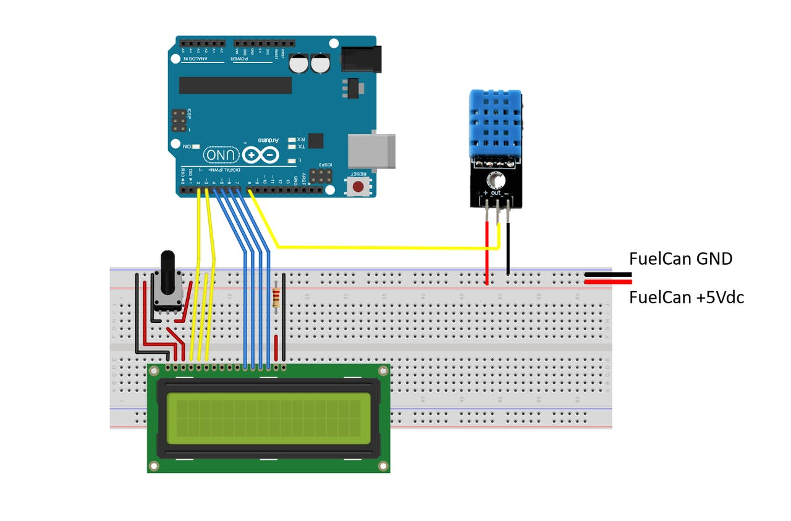

# PictureSkew
## A project initiative to smartify Indian general stores using Network Systems and Applied-IoT

    
    
    
    

 
---
## Overview
The aim of the project is to build an open-source powerful
Human-Computer emotion analyzer platform for research in the field of
smartfying Indian general stores. Various deep learning and computer
vision algorithms are being implemented on the IoT hardware including
person tracking, gesture control using human pose estimation, and depth
estimation using monocular vision. The device will capture customer
movement & regulate the surrounding environment of the store like lighting,
air-conditioning & data will be further transferred to ThingSpeaks,
Google cloud for real-time visualization. It is a project that aims towards smartifying department stores, by monitoring air conditions and customer behaviour, of course while respecting their integrity. The smart store device can be installed in multiple sections in the store and once installed, data about air conditions and customer movement activity will be transmitted to the sigfox network and further on to ThingSpeaks and google cloud for real-time visualisation.
Estimated time: 1Week

---
**Table of Contents**
- [Smart Store](#smart-store)
  - [Overview](#overview)
  - [Objective](#objective)
  - [Material](#material)
    - [Hardware](#hardware)
    - [Software](#software)
  - [Computer setup](#computer-setup)
  - [Putting everything together](#putting-everything-together)
  - [Platform](#platform)
    - [Sigfox backend](#sigfox-backend)
    - [Google Cloud](#google-cloud)
    - [ThingSpeaks](#ThingSpeaks)
  - [The Code](#the-code)
  - [Transmitting the data / connectivity](#transmitting-the-data--connectivity)
  - [Presenting the data](#presenting-the-data)
    - [ThingSpeaks](#ThingSpeaks-1)
    - [Google Cloud - Data Studio](#google-cloud---data-studio)
  - [Finalizing the design](#finalizing-the-design)
    - [Final thoughts](#final-thoughts)
    - [Data studio (Live data)](#data-studio-live-data)
    - [ThingSpeaks (Live data)](#ThingSpeaks-live-data)

---

## Material

### Hardware
| Component                    | Task             | Price  | Link
| -----------------------------| ---------------- |--------|---
| Arduino, exp-board & antenna   | To power sensors and communicate with the sigfox backend          | ~₹375   | [here](https://www.electronicscomp.com/arduino-uno-r3-compatible-best-price-india)
| Breadboard      | To help us connect our sensors to the lopy4 | ~₹65 | [here](https://www.roboelements.com/product/400-point-solderless-prototype-breadboard/)
| BME680 Air Quality Sensor      | Monitor Air Conditions | ~₹1400 | [here](https://www.amazon.in/Robocraze-BME680-Temperature-Humidity-Pressure/dp/B07WT5H63R/ref=asc_df_B07WT5H63R/?tag=googleshopdes-21&linkCode=df0&hvadid=397074532463&hvpos=&hvnetw=g&hvrand=3579343116281868515&hvpone=&hvptwo=&hvqmt=&hvdev=c&hvdvcmdl=&hvlocint=&hvlocphy=9061680&hvtargid=pla-837220458430&psc=1&ext_vrnc=hi)
| HC-SR501 PIR Movement Detection      | To help us connect our sensors to the Arduino Uno | ~₹500 | [here](https://create.arduino.cc/projecthub/electropeak/pir-motion-sensor-how-to-use-pirs-w-arduino-raspberry-pi-18d7fa)
| Resistor bundle with 1 Resistor 220 Ohms 1%      | To power our led when movement is detected (Mostly for debugging purposes, thus not really necessary) | ~₹450 | [here](https://www.amazon.in/Electronic-Components-Breadboard-transistor-components/dp/B08SR1M4CH/ref=asc_df_B08SR1M4CH/?tag=googleshopdes-21&linkCode=df0&hvadid=397081650884&hvpos=&hvnetw=g&hvrand=10282259566278470469&hvpone=&hvptwo=&hvqmt=&hvdev=c&hvdvcmdl=&hvlocint=&hvlocphy=9061680&hvtargid=pla-1169061307883&psc=1&ext_vrnc=hi)

### Software
| IoT Thing | Link   |
| --------- | ----------- |
| Sigfox-backend Account   | [Here](https://support.sigfox.com/docs/backend-user-account-creation)          |
| ThingSpeaks account      | [Here](https://thingspeak.com/login/mwa-sso/check)  |
| Google Cloud console      | [Here](https://console.cloud.google.com)  |
| Google Cloud functions    | [Here](https://cloud.google.com/functions)  |
| Google Cloud pubsub       | [Here](https://cloud.google.com/pubsub)  |
| Google Cloud bigquery     | [Here](https://cloud.google.com/bigquery)  |

## Computer setup

- [X] ***Chosen IDE***
    VSCode

- [X] ***How the code is uploaded***
    From VSCode with the PyMakr-plugin though a micro usb cable connected to the Arduino expantion board

- [X] ***Steps that you needed to do for your computer. Installation of Node.js, extra drivers, etc.***
1. Update device firmware, more about that [here](https://pypi.org/project/arduino-python3/).
2. Create a project folder and open it with vscode.
3. Upload some example code e.g. [RGB LED](https://pypi.org/project/arduino-python3/) to test connectivity

## Putting everything together

- [X] ***Circuit diagram (can be hand drawn)***

